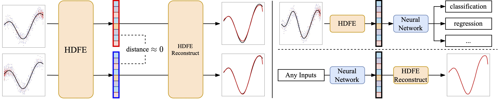

<h1 align='center' style="text-align:center; font-weight:bold; font-size:2.0em;letter-spacing:2.0px;"> Decodable and Sample Invariant Continuous Object Encoder </h1>

    <a href="https://www.cs.umd.edu/~dhyuan" target="_blank" style="text-decoration: none;">Dehao Yuan</a>&nbsp;,&nbsp;
    <a href="https://http://furong-huang.com" target="_blank" style="text-decoration: none;">Furong Huang</a>&nbsp;,&nbsp;
    <a href="http://users.umiacs.umd.edu/~fer/" target="_blank" style="text-decoration: none;">Cornelia Fermüller</a>&nbsp;,&nbsp;
    <a href="http://users.umiacs.umd.edu/~yiannis/" target="_blank" style="text-decoration: none;">Yiannis Aloimonos</a>&nbsp;&nbsp;

<b>
<em>arXiv-Preprint, 2023</em> &nbsp&nbsp&nbsp&nbsp <a href="" target="_blank" style="text-decoration: none;">[arXiv]</a>
</b>

### Abstract
We propose Hyper-Dimensional Function Encoding (HDFE). **Left**: Given samples of a continuous object (e.g. a function), HDFE encodes the object into a fixed-length vector without any training. The encoding is not affected by the distribution and size with which the object is sampled. The encoding can be decoded to reconstruct the continuous object. **Right**: Applications of HDFE. HDFE can be used to perform machine learning tasks (e.g. classification, regression) on continuous objects. HDFE also enables neural networks to regress continuous objects by predicting their encodings.

### Gain some Insights of HDFE

