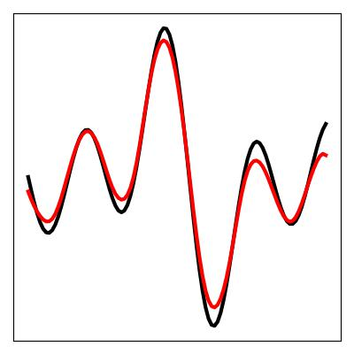
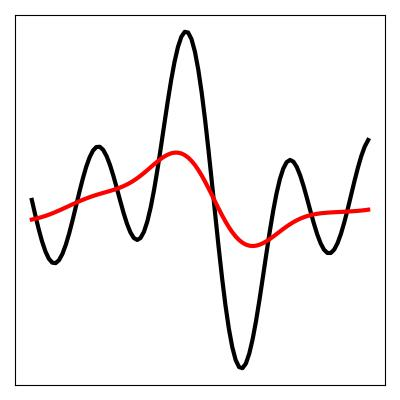
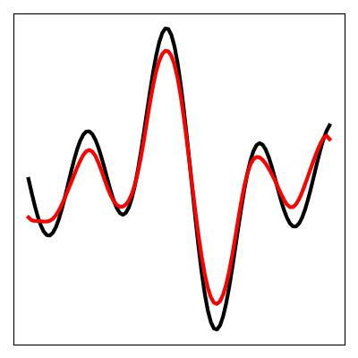
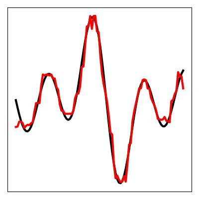
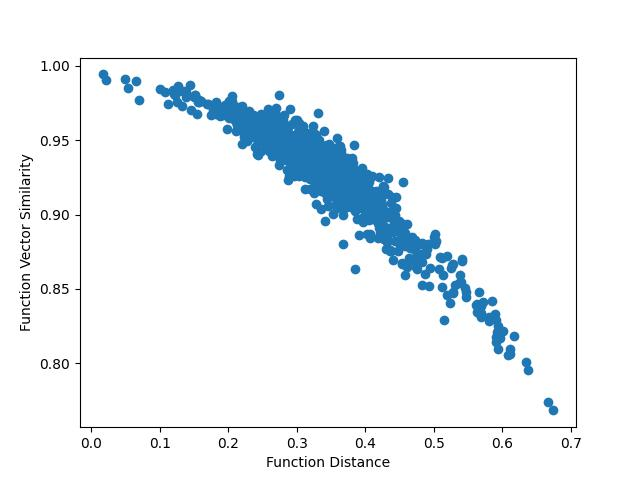
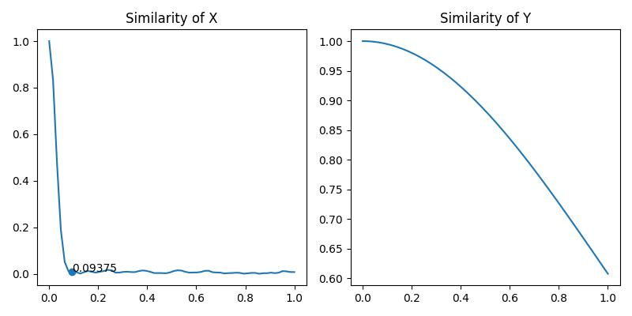

<h1 align='center' style="text-align:center; font-weight:bold; font-size:2.0em;letter-spacing:2.0px;"> Decodable and Sample Invariant Continuous Object Encoder </h1>

<p align='center' style="text-align:center;font-size:1.25em;">
    <a href="https://www.cs.umd.edu/~dhyuan" target="_blank" style="text-decoration: none;">Dehao Yuan</a>&nbsp;,&nbsp;
    <a href="https://furong-huang.com" target="_blank" style="text-decoration: none;">Furong Huang</a>&nbsp;,&nbsp;
    <a href="http://users.umiacs.umd.edu/~fer/" target="_blank" style="text-decoration: none;">Cornelia Fermüller</a>&nbsp;,&nbsp;
    <a href="http://users.umiacs.umd.edu/~yiannis/" target="_blank" style="text-decoration: none;">Yiannis Aloimonos</a>&nbsp;&nbsp;
</p>

<p align='center';>
<b>
<em>arXiv-Preprint, 2023</em> &nbsp&nbsp&nbsp&nbsp <a href="" target="_blank" style="text-decoration: none;">[arXiv]</a>
</b>
</p>

## Abstract
We propose Hyper-Dimensional Function Encoding (HDFE). **Left**: Given samples of a continuous object (e.g. a function), HDFE encodes the object into a fixed-length vector without any training. The encoding is not affected by the distribution and size with which the object is sampled. The encoding can be decoded to reconstruct the continuous object. **Right**: Applications of HDFE. HDFE can be used to perform machine learning tasks (e.g. classification, regression) on continuous objects. HDFE also enables neural networks to regress continuous objects by predicting their encodings.


## Gain some Insights of HDFE
`HDFE.py` contains all the functionalities of HDFE. Feel free to explore them with the following example script:
```
python example.py
```

**Reconstruction of Function Encoding:**  Under a suitable selection of receptive field and dimensionality, HDFE can produce a decodable encoding of the original function. **Left**: suitable receptive field and suitable dimension. **Mid**: too large receptive field and suitable dimension. **Right**: suitable receptive field and too small dimension.



**Binary Vector Implementation of HDFE:** In addition to the fractional power encoding introduced in the paper, we also implement a binary vector encoding version of HDFE. **It runs faster and yields comparable performance** as the FPE encoding. Below shows the reconstruction of the binary vector implementation of HDFE. It has not been optimized for the memory consumption and takes a lot of GPU memory. However, it is not difficult to do that optimization from the methodology perspective. It just requires a lot of engineering, so I haven't done it yet. If you are interested in using this architecture in some real-time applications, and require that implementation. Feel free to contact me.

**Isometry Property**: In the paper we show that HDFE preserves the function distance. We have an experiment to demonstrate the property.

**Receptive Field of HDFE**: We provide a functionality to check and visualize the receptive field of HDFE.

<div style="text-align: center">
    
</div>

## Experiments
We also provide the source code for reproducing the experiments in the paper. Please checkout the corresponding repositories below.
### <a href="Exp1_PDE_solver">PDE Solver</a>
To solve PDEs using neural networks, we first encode the PDE and its solution into their vector embeddings using HDFE. Then, we train a multi-layer perceptron to map the embedding of the PDE to the embedding of its solution. The optimization target is the cosine similarity between the predicted embedding and the true embedding. Since the embeddings are complex vectors, we adopt a <a href="https://github.com/wavefrontshaping/complexPyTorch">Deep Complex Network</a> as the architecture of the multi-layer perceptron.


### <a href="Exp2_point_cloud_normal">Surface Normal Estimation</a>

### <a href="Exp3_integrate">Integrate HDFE into SOTA PointNet-based Network</a>

## Contact
If you find this paper useful, please consider citing:
```
paper citation
```
If you have any question or have any issue running the codes, feel free to contact me at dhyuan@umd.edu.
